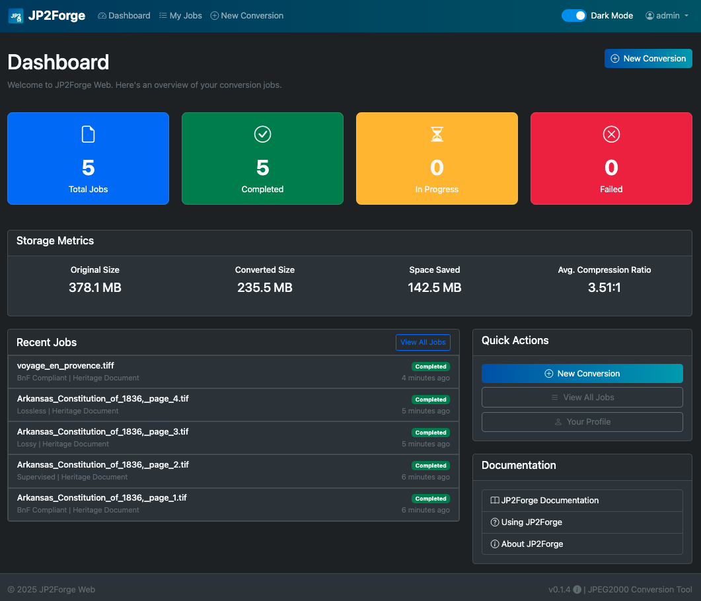

# JP2Forge Web Application

[](https://opensource.org/licenses/MIT) 
[](https://github.com/xy-liao/jp2forge_web) 
[](https://github.com/xy-liao/jp2forge_web/releases/tag/v0.1.4)

A web interface for the JP2Forge JPEG2000 conversion library, providing an easy-to-use system for converting and managing image files in the JPEG2000 format.

**Important Note**: This application serves primarily as a promotional demonstration for the [JP2Forge script](https://github.com/xy-liao/jp2forge) and its BnF (Bibliothèque nationale de France) compliance capabilities. JP2Forge Web doesn't leverage all available arguments and features of the underlying JP2Forge script - it's a case study implementation showcasing selected functionality of the more comprehensive JP2Forge tool.

**Documentation**: All documentation is located in the [docs folder](docs/). For an overview of available documentation, see the [docs/README.md](docs/README.md) file.

## Dashboard Screenshot



## Quick Links

- [User Guide](docs/user_guide.md) - How to use the application
- [Docker Setup](docs/docker_setup.md) - Docker installation instructions
- [Troubleshooting](docs/troubleshooting.md) - Solutions for common issues

## Features

- Interactive Dashboard with conversion statistics, storage metrics, and job monitoring
- Convert images to JPEG2000 format with various options
- Support for different compression modes: lossless, lossy, supervised, and BnF-compliant
- Support for multiple document types: photograph, heritage document, color, grayscale
- Parallel processing of conversion jobs with Celery
- User authentication and job management
- Detailed conversion reports with quality metrics
- Multi-page TIFF support
- Real-time progress tracking
- Service management tools to prevent multiple running instances during testing
- Enhanced HTTP method handling with proper security protections
- Comprehensive documentation with aligned templates and markdown content

## Supported File Formats

### Input Formats
- **JPEG/JPG**: Standard photographic format
- **TIFF/TIF**: Both single-page and multi-page TIFF files are supported
- **PNG**: Lossless raster graphics format
- **BMP**: Bitmap image format

### Output Format
- **JPEG2000/JP2**: Converted files follow the JP2 format specification
- Compliant with ISO/IEC 15444-1 (when using BnF compliance mode)

## Quick Start Installation

### Prerequisites

Before installing JP2Forge Web, ensure you have the following prerequisites installed:

- Python 3.11 or higher (Python 3.12 recommended for best security)
- Redis (required for Celery task queue)
- ExifTool (for metadata functionality)

### Using Docker (Recommended)

```bash
# Clone the repository
git clone https://github.com/xy-liao/jp2forge_web.git
cd jp2forge_web

# Run the Docker setup script
chmod +x docker_setup.sh
./docker_setup.sh
```

For detailed Docker instructions, see the [Docker Setup Guide](docs/docker_setup.md).

### Manual Installation

```bash
# Clone the repository
git clone https://github.com/xy-liao/jp2forge_web.git
cd jp2forge_web

# Run the setup script
chmod +x setup.sh
./setup.sh

# Initialize the application
python init.py

# Start the application services
chmod +x start_dev.sh start_celery.sh
./start_dev.sh  # Starts the Django development server
# In a separate terminal:
./start_celery.sh  # Starts the Celery worker
```

For complete installation instructions and configuration options, see the [Installation Guide](docs/installation.md).

## Managing Services

JP2Forge Web includes tools to manage all related services (Django, Celery, Redis) and prevent issues with multiple instances running during development and testing:

```bash
# Check status of all services
python manage_services.py status

# Stop all services and clean up the environment
python manage_services.py clean

# Start all services in the correct order
python manage_services.py start

# Restart all services
python manage_services.py restart

# Manage specific services only (django, celery, redis, postgres)
python manage_services.py start --services=django,celery
```

These tools ensure a clean environment for each test run and prevent port conflicts or resource contention from multiple service instances. The `manage_services.py` script is the recommended way to manage JP2Forge Web services during development and testing.

## 🚨 Common Issues

### JP2Forge Dependency Issues
```bash
# If JP2Forge installation fails from PyPI
ERROR: Could not find a version that satisfies the requirement jp2forge==0.9.6

# Solutions:
1. Check PyPI connectivity and retry: pip install jp2forge==0.9.6
2. Check Python version (requires Python >=3.8): python --version
3. Run in mock mode for UI testing: set JP2FORGE_MOCK_MODE=True in .env
4. For production: Ensure PyPI access to install JP2Forge 0.9.6

Note: JP2Forge Web requires EXACTLY version 0.9.6 - other versions are not supported
```

### Mock Mode Operation
When JP2Forge is unavailable, the application runs in **mock mode**:
- ✅ Web interface fully functional
- ✅ User authentication and job management
- ✅ File upload and validation
- ❌ No actual JPEG2000 conversion
- ❌ Mock outputs for testing only

### Redis Connection Error
```bash
# Start Redis server
redis-server

# Check Redis status
redis-cli ping
```

### Celery Worker Not Starting
```bash
# Check if another Celery instance is running
python manage_services.py status

# Clean and restart
python manage_services.py clean
./start_celery.sh
```

### Docker Build Failures
```bash
# If Docker entrypoint files are missing
ERROR: "/docker-entrypoint.sh": not found

# Ensure these files exist:
docker-entrypoint.sh
healthcheck.sh

# They should be created automatically by setup scripts
```

For detailed troubleshooting, see the [Troubleshooting Guide](docs/troubleshooting.md).

## License

This project is licensed under the MIT License - see the LICENSE file for details.
