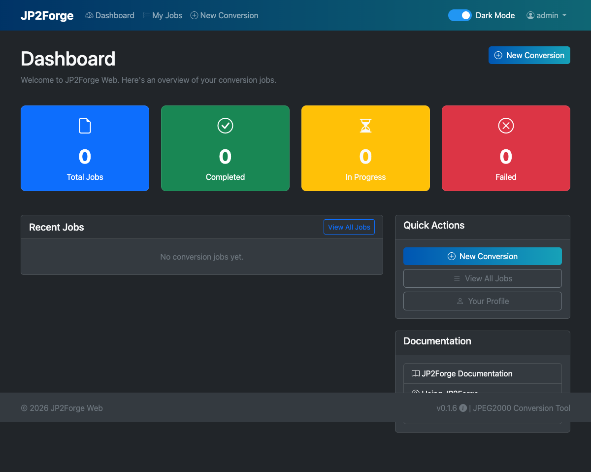

# JP2Forge Web — Reference Implementation

[](https://github.com/xy-liao/jp2forge_web/releases/tag/v0.1.6) [](https://opensource.org/licenses/MIT) [](https://www.python.org/downloads/) [](https://github.com/xy-liao/jp2forge_web) [](https://www.sonarsource.com/products/sonarqube/)

A reference implementation showing how to integrate [JP2Forge](https://github.com/xy-liao/jp2forge) into a production-grade web service for institutional JPEG2000 conversion workflows.

## Purpose & Scope

This project is a **case study**, not a general-purpose application. It demonstrates one concrete answer to the question: *how should an institution deploy JP2Forge as a shared internal service?*

The stack — Django, Celery, Redis, PostgreSQL, Docker — is intentionally production-grade. For an institution processing hundreds of high-resolution TIFFs submitted by multiple staff members simultaneously, asynchronous job queuing (Celery + Redis) is the correct architecture: it prevents web server timeouts, provides real-time progress tracking, and keeps a persistent audit trail of every conversion job.

This project does not expose every JP2Forge parameter. It covers the subset most relevant to institutional digitization workflows: BnF-compliant conversion, quality validation, and batch processing with authentication and job management.

> If you need a command-line tool or a Python library for JPEG2000 conversion, use [JP2Forge](https://github.com/xy-liao/jp2forge) directly.

## Dashboard Screenshot



## Features

- **Interactive Dashboard** with conversion statistics, storage metrics, and job monitoring
- **Convert images to JPEG2000** format with various compression options
- **Multiple compression modes**: lossless, lossy, supervised, and BnF-compliant
- **Document type support**: photograph, heritage document, color, grayscale
- **Parallel processing** of conversion jobs with Celery
- **User authentication** and job management
- **Detailed conversion reports** with quality metrics (PSNR, SSIM)
- **Multi-page TIFF support**
- **Real-time progress tracking**
- **Batch file processing**

## Supported File Formats

### Input Formats
- **JPEG/JPG**: Standard photographic format
- **TIFF/TIF**: Both single-page and multi-page TIFF files
- **PNG**: Lossless raster graphics format
- **BMP**: Bitmap image format

### Output Format
- **JPEG2000 (.jp2)**: ISO standard for image compression

**File Size Limits**: 100MB per file

## Installation

### Quick Setup with Docker (Recommended)

```bash
# Clone the repository
git clone https://github.com/xy-liao/jp2forge_web.git
cd jp2forge_web

# Run automated setup script
chmod +x setup.sh
./setup.sh docker
```

The script automatically:
- Generates secure passwords for database and Redis
- Configures environment variables
- Builds and starts all containers
- Creates default admin user (admin/admin123)

**Access the application**: http://localhost:8000

### Manual Installation

#### Prerequisites
- Redis server
- ExifTool
- Git

#### Setup Steps

```bash
# Clone repository
git clone https://github.com/xy-liao/jp2forge_web.git
cd jp2forge_web

# Run automated manual setup script
chmod +x setup.sh
./setup.sh

# Start services (Django server + Celery worker)
./dev.sh
```

**Access the application**: http://localhost:8000

## User Guide

### Getting Started

1. **Create an account** or log in with existing credentials
2. **Navigate to "New Conversion"** in the main menu
3. **Upload files** by clicking "Choose Files" or drag-and-drop
4. **Configure settings** (compression mode, document type, quality)
5. **Submit job** and monitor progress in real-time
6. **Download results** once conversion is complete

### Compression Options

| Mode | Description | Use Case |
|------|-------------|----------|
| **Lossless** | No quality loss, larger files | Archival, critical documents |
| **Lossy** | Higher compression, some quality loss | General use, web images |
| **Supervised** | Quality-controlled with metrics | Balanced quality/size |
| **BnF Compliant** | Meets BnF digitization standards | Cultural heritage institutions |

### Document Types

- **Photograph**: Standard photographic images (default)
- **Heritage Document**: Historical documents with enhanced quality settings
- **Color**: General color images
- **Grayscale**: Black and white images

### Quality Metrics (Supervised Mode)

- **PSNR**: Peak Signal-to-Noise Ratio (higher = better quality)
- **SSIM**: Structural Similarity Index (closer to 1.0 = better quality)
- **Compression Ratio**: Original size vs compressed size

## Docker Management

### Useful Commands

```bash
# View all logs
docker-compose logs

# View specific service logs
docker-compose logs web
docker-compose logs worker

# Restart services
docker-compose restart

# Stop all services
docker-compose down

# Start services
docker-compose up -d

# Access Django shell
docker-compose exec web python manage.py shell

# Run migrations
docker-compose exec web python manage.py migrate
```

### Service Management

```bash
# Check service status
./dev.sh status

# Stop and cleanup all services
./dev.sh clean

# Start all services
./dev.sh start

# Restart all services
./dev.sh restart
```

## Troubleshooting

### Common Issues

**"Redis connection failed"**
- Ensure Redis is running: `brew services start redis` (macOS) or `sudo service redis-server start` (Linux)
- Check Redis password in .env file

**"Database connection error"**
- For Docker: `docker-compose down -v && docker-compose up -d`
- For manual: Check database settings in .env

**"Import error: No module named 'jp2forge'"**
- Ensure JP2Forge 0.9.7 is installed: `pip install jp2forge==0.9.8`
- For Docker: Rebuild containers: `docker-compose build --no-cache`
- Check virtual environment activation: `source venv/bin/activate`

**"Permission denied" errors**
- Ensure scripts are executable: `chmod +x *.sh`
- Check file permissions in media directory

**"Port already in use"**
- Stop conflicting services: `python manage_services.py clean`
- Use different ports in .env file

**Conversion jobs stuck in "Processing"**
- Restart Celery worker: `./start_celery.sh` or `docker-compose restart worker`
- Check Celery logs: `docker-compose logs worker`

### Development Mode

Enable mock mode for testing without actual conversions:

```bash
# In .env file
JP2FORGE_MOCK_MODE=True
```

### Log Files

- **Django**: `logs/django.log`
- **Celery**: `logs/celery.log`
- **Conversion errors**: `logs/converter.log`
- **System errors**: `logs/error.log`

## Architecture

### Core Components

- **Django 5.2+**: Web framework — authentication, job management, admin interface
- **Celery 5.5+**: Asynchronous task queue — handles long-running conversions without blocking the web server
- **Redis 6.2+**: Message broker for Celery; also used for caching
- **PostgreSQL 16+**: Persistent job and audit log storage (Docker) / SQLite (development)
- **JP2Forge 0.9.8**: JPEG2000 conversion engine with BnF compliance

### Security Features

- **CSRF protection** on all forms and state-changing operations
- **HTTP method validation** with explicit GET/POST restrictions
- **User authentication** required for all conversion operations
- **File upload validation** with type checking and size limits (100MB max)
- **Secure password hashing** using Django's PBKDF2 algorithm
- **Docker security** with non-root user and restricted privileges
- **Input sanitization** and XSS protection
- **Session security** with secure cookie settings

## Contributing

This is a single-developer project. For questions or issues, please open a GitHub issue.

## License

This project is licensed under the MIT License - see the [LICENSE](LICENSE) file for details.

## Version History

See [CHANGELOG.md](CHANGELOG.md) for detailed version history and updates.

## Related Projects

- **[JP2Forge](https://github.com/xy-liao/jp2forge)**: The underlying JPEG2000 conversion library