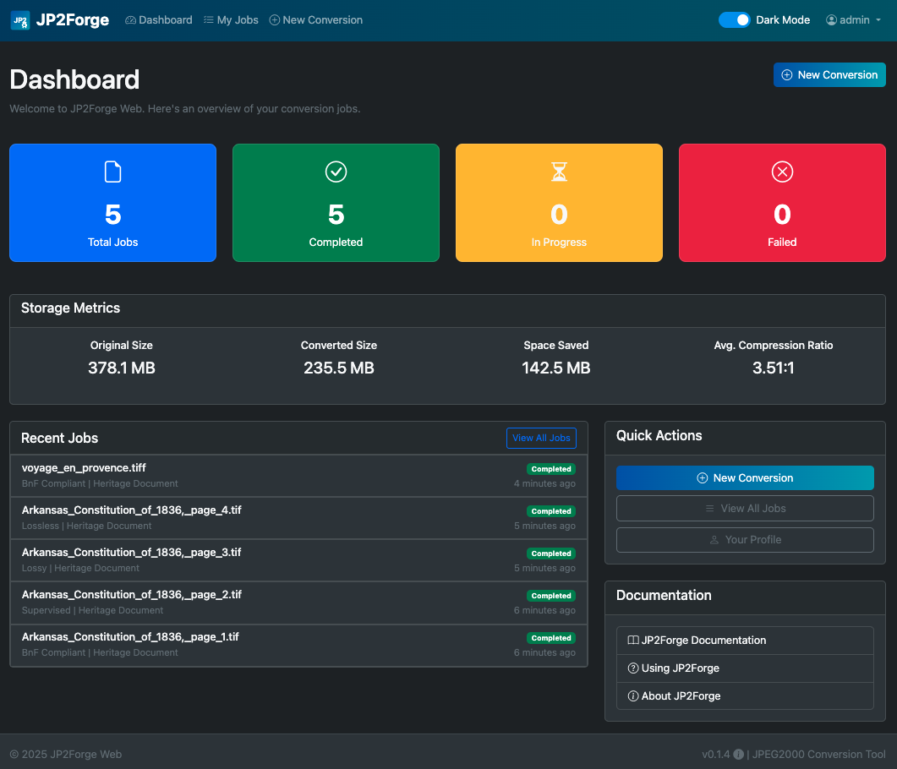
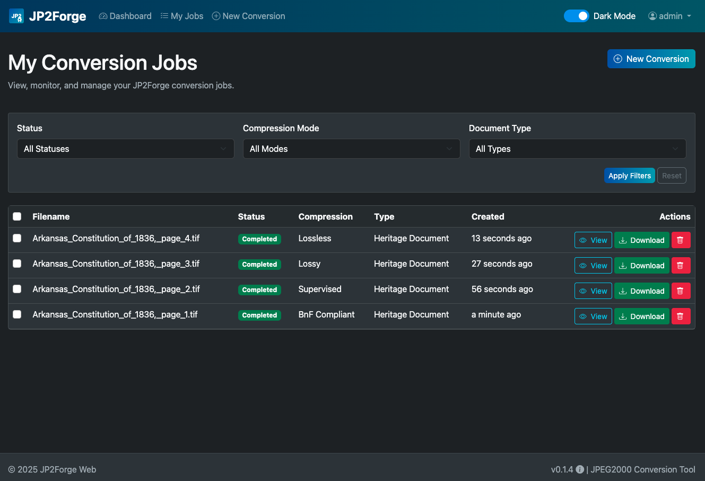
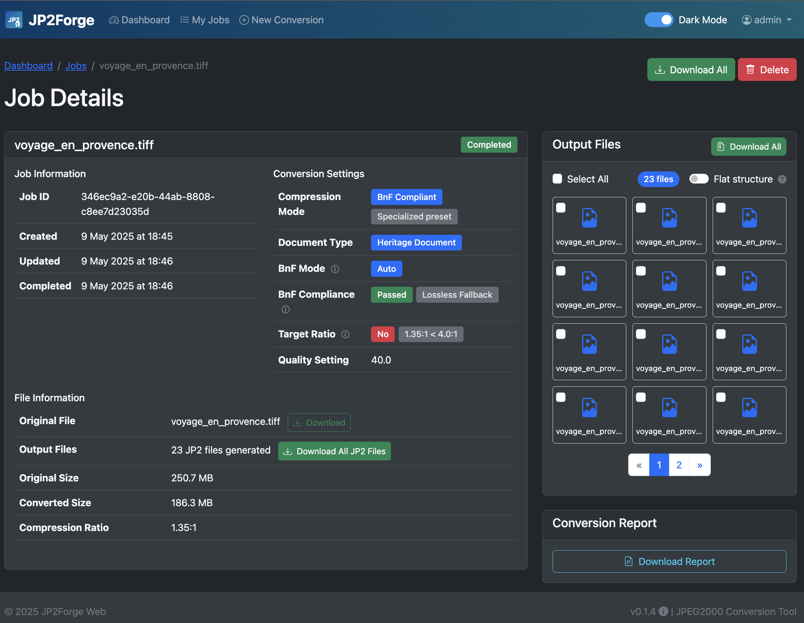

# JP2Forge Web User Guide

Welcome to the JP2Forge Web User Guide! This document will help you learn how to convert your images to the JPEG2000 format quickly and effectively.

## Quick Start

1. **Upload** - Select one or more images to convert
2. **Configure** - Choose your compression settings 
3. **Convert** - Submit your job and wait for processing
4. **Download** - Get your converted JPEG2000 files

## Creating a Conversion Job

To start converting your images:

1. Log in to your account
2. Click on "New Job" in the navigation menu
3. Click "Choose Files" to select images to convert
4. Configure your conversion settings (details below)
5. Click "Upload and Convert" to start the process

*The configuration interface allows you to select files and configure conversion settings*

**Supported File Types:** JPG/JPEG, TIFF/TIF, PNG, and BMP

**Maximum File Size:** 100MB per file

## Choosing Compression Settings

### Compression Mode

JP2Forge Web offers four compression modes to meet different needs:

*The dashboard shows conversion statistics and allows you to monitor active jobs*

| Mode | Best For | Quality Setting | Description |
|------|----------|----------------|-------------|
| **Lossless** | Archival preservation | Not needed | Preserves all image data perfectly with no quality loss. Creates larger files. |
| **Lossy** | Web display, storage efficiency | Required (20-100) | Reduces file size by allowing controlled quality reduction. |
| **Supervised** | Expert use, fine control | Required (20-100) | Provides detailed control over the compression process with quality metrics. |
| **BnF Compliant** | Cultural heritage submissions | Not needed | Follows Bibliothèque nationale de France digitization standards. |

### Document Type

Select the document type that best matches your source material:

| Type | Best For | Characteristics |
|------|----------|----------------|
| **Photograph** | Photos, continuous-tone images | Optimizes for detail preservation in photographic images |
| **Heritage Document** | Historical documents, manuscripts | Emphasizes text clarity and detail in heritage materials |
| **Color** | Graphics, illustrations | Enhanced color fidelity for vibrant content |
| **Grayscale** | Black & white content | Optimized for contrast in grayscale images |

## Understanding BnF Compliance

BnF compliance refers to meeting the digitization standards set by the Bibliothèque nationale de France for digital preservation.

### How to Enable BnF Compliance

You can enable BnF compliance in two ways:

1. **Select "BnF Compliant" as your compression mode** - Applies all BnF standards as a complete preset
2. **Check the "BnF Compliant" box** - When using other compression modes to apply BnF standards to your preferred compression approach

### What to Expect with BnF Compliance

When using BnF compliance:

- Target compression ratios are set automatically based on your document type
- Technical parameters are configured according to BnF standards
- Quality metrics might not be displayed (compliance is parameter-based, not metrics-based)
- The system may automatically fall back to lossless compression to preserve quality when needed

### BnF Compliance Results

After conversion, you'll see these indicators:

- **BnF Mode**: Shows if you selected BnF compliance during job creation
- **BnF Compliance**: Indicates whether the output meets BnF standards
- **Target Ratio**: Shows if the specific compression ratio target was achieved

A "Lossless Fallback" indicator means the system automatically switched to lossless compression to preserve quality while maintaining BnF compliance.

## Managing Your Jobs

### Viewing Job Status

After submitting a job:

- You'll see the job detail page with current status
- Status progresses from "Pending" → "Processing" → "Completed" (or "Failed")
- Completed jobs show download links for your converted files

### Jobs List Page

From the "My Jobs" page, you can:

- See all your conversion jobs in one place
- Filter jobs by status (Pending, Processing, Completed, Failed)
- Sort by creation date, name, or status
- Click on any job to view its details
- Delete jobs you no longer need

### Job Retention

Completed jobs and their files are kept for 30 days by default, after which they may be automatically removed to save space.

## Downloading Converted Files

To download your converted JPEG2000 files:

1. Go to the job detail page by clicking on a job in your jobs list
2. For each successfully converted file, click the "Download" button
3. For multi-page documents, individual pages appear as separate files

*The results view shows conversion details and allows you to download your converted files*

*The detailed view provides comprehensive metrics and information about each converted file*

## Troubleshooting

If you encounter issues, please check the [Troubleshooting Guide](/docs/troubleshooting/) for solutions to common problems.

---

*Note: JP2Forge Web serves primarily as a demonstration for the JP2Forge script's capabilities. For access to all advanced features, consider using the [JP2Forge command-line tool](https://github.com/xy-liao/jp2forge).*